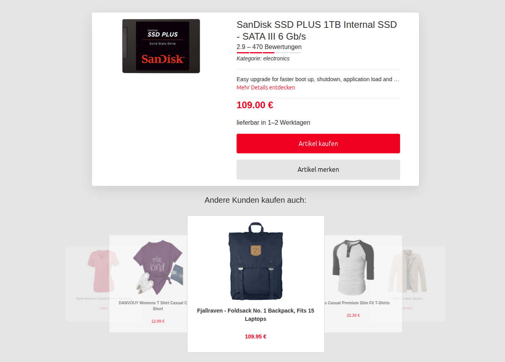

# 🛒 Demo Project: Product Card

This is a demo project called **Product Card**.  
It showcases random product cards using data from the Fake Store API.

👉 [API Documentation](https://fakestoreapi.com/docs)

---

## 🚀 Features

- Display of a random product card from the Fake Store API
- Carousel showing all available products
- Ability to save products to personal favorites using Local Storage
- Responsive layout for desktop and mobile
- Clean and minimal UI

---

## 🛠 Tech Stack

- Vue
- Google Material Design (CSS & JS)

---

## 👀 Project Preview

---

## 🌐 Live Demo

🔗 https://product-card-project.onrender.com

---

## 📌 Notes

This project was created for learning and demonstration purposes.

---
